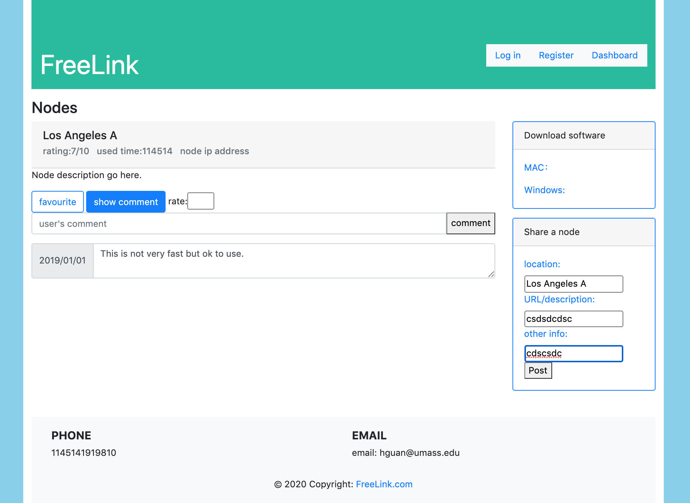
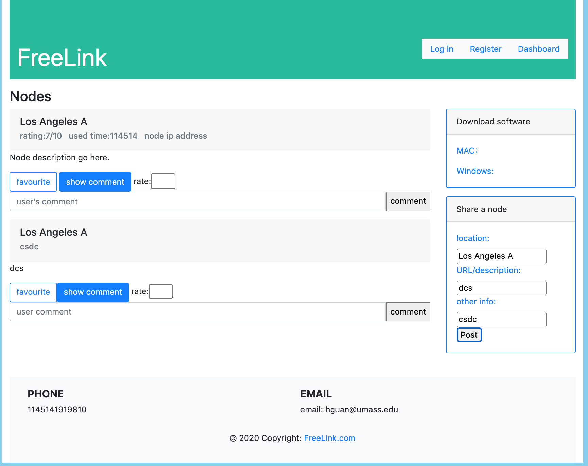
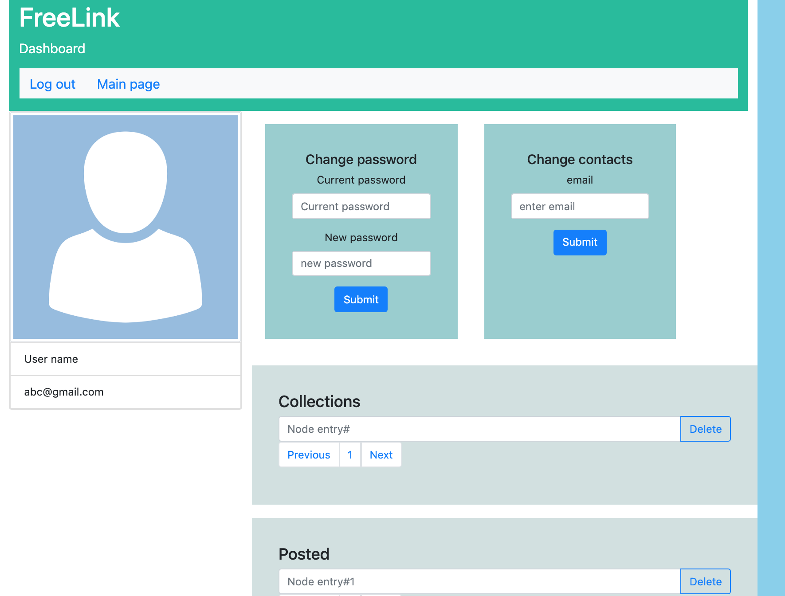
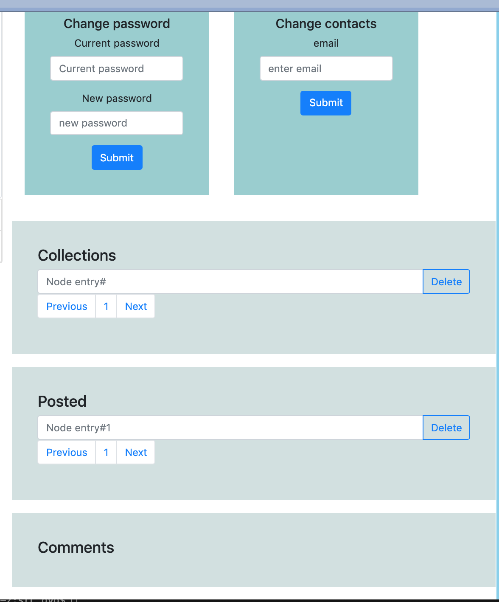

# Part 1 API Planning #

`POST  /user/{USER_ID}`  
Used for login to get a user’s information.  
Parameters:{name, password}  
response:{id, email}  

`POST  /user` \
Used for registration to create a user’s information.\
Parameters:{name, email, password}\
Response:{id}

`PUT  /user/userId`\
This endpoint will update a user’s information. Used for profile page.\
Request body: { “user_id”: 10, “email”: “xxx@gmail.com”}. { “user_id”: 10, “password”: 123}

`GET /user/nodes/NODE_ID`\
This endpoint will be used to get a user’s posted nodes. Used for profile page.\
Response body: a collection of node’s name and description.\
 [{“name”: “Los Angeles A” , “description”:string }……{“name”: “Los Angeles A”, “description”: string}]
 
`POST  /user/nodes`\
This endpoint will be used to post a node. Used for homepage.\
Example request body: { “user_id”: 10, “node_info”:{}, “name”:”Los Angeles A”, “description”:”abc”}\
response body: { “node_id”:111}

`DELETE /user/userId/nodes/NODE_ID`\
Used for a user to delete a posted node in his/her profile.

`GET /user/userId/favorite`\
This endpoint will be used to get a user’s collection. Used in profile.\
Response body: a collection of node name and description.\
[{name, description}, {name, description}…]

`POST /user/favorite`\
This endpoint will be used for adding a node to users’ collection. Used in the homepage.\
Example request body: { “user_id”: 10, “node_id”: 10  }

`DELETE /user/favorite`\
This endpoint will be used to delete a node in user’s collection.\
Example request body: {“user_id”: 10,  node_id”: 10}

`GET  /user/comments/COMMENT_ID`\
This endpoint will be used to get a user’s comment.\
Response body: a collection of comments.\
[{ “text”: “sdscsdsd”, “update_time”:”2000-01-10”}….{ “text”: “sdscsdsd”, “update_time”:”2000-01-10”}]

`DELETE /user/comments/COMMENT_ID`\
This endpoint will be used to delete a user’s comment. Used in profile.

`GET /node/NODE_ID/comments`
This endpoint will be used to get a user’s comment. Used in profile.\
Response body: a collection of comments: [{ “text”: “sdscsdsd”, “update_time”:”2000-01-10”}….{ “text”: “sdscsdsd”, “update_time”:”2000-01-10”}]

`POST   /node/NODE_ID/comments`\
This endpoint will be used to post a comment. Used in homepage.\
Example request body: {“uid”:0, “text”: “azz”} \
Response: comment_id (string)

`DELETE  /node/NODE_ID/comments`\
This endpoint will be used by a user to delete a comment. Used in the Profile page.

`POST   /node/score`\
This endpoint will be used to send a user's rating.\
request body: {node_id,score}\
Response: new rating

# Part 2 Screenshots of your client interface 
### Create

In this example a user creates a post.
### Read

When entering dashboard the user interface will get fetched information for each part for user to read.
### Update 

A user can update password or email in the dashboard.
### Delete 

In this example,the user deletes a comment.

# Part 3 Heroku Application

# Labor division
